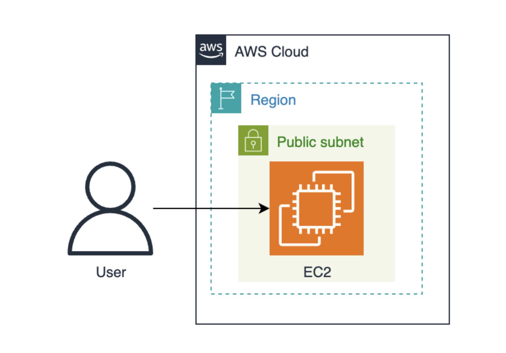

# aws-ec2-webserver

## Overview
This project demonstrates deploying a public web server on AWS using Amazon EC2 inside a custom VPC.
The web server runs Apache and is accessible via a public IP address.

## Architecture

## AWS Services Used
- Amazon EC2
- Amazon VPC
- Security Groups
- Apache HTTP Server
- AWS Amplify

## What Was Built
- Custom VPC with public subnet
- EC2 instance (t3.micro)
- Apache web server
- Public IP & DNS access
- Frontend deployment using AWS Amplify

## Screenshots
All deployment screenshots are available in the screenshots folder.

## Cost Awareness
All resources were deleted after testing to avoid ongoing AWS charges.
